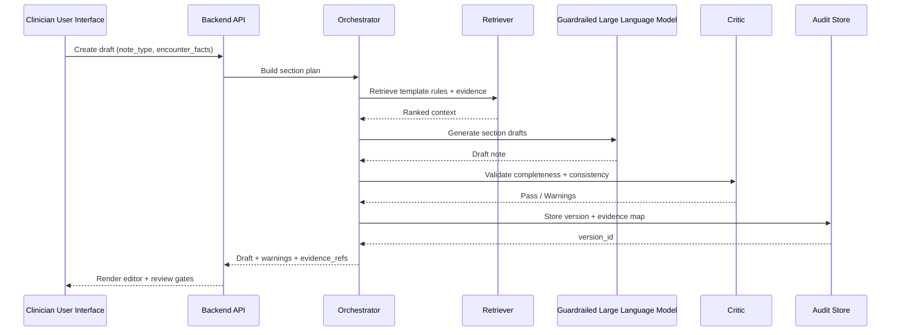

# InsightNotes — Clinical Notes Documentation  
**Artificial Intelligence-assisted, privacy-first clinical note drafting with evidence-linked Retrieval-Augmented Generation (RAG) and multi-agent quality checks**

<p align="center">
  
</p>

<p align="center">
  
  
  
</p>


%20%7C%20Agentic%20Critic-blueviolet)


InsightNotes is a **clinical documentation assistant** engineered to transform structured encounter inputs into **high-quality, template-aligned clinical note drafts** for formats such as **Subjective Objective Assessment Plan (SOAP)**, **Data Assessment Plan (DAP)**, **Behavior Intervention Response Plan (BIRP)**, progress notes, and discharge summaries.

This repository is purposefully built to look and read like a **real healthcare documentation platform** backed by disciplined software engineering, not a one-off prompt experiment. The system emphasizes what matters in clinical environments: **structure, consistency, auditability, and clinician control**.

**Core philosophy**  
**Structure first → Retrieval second → Generation last → Critic always**

---

## Table of Contents
- The Problem This Solves
- Vision and Motivation
- What InsightNotes Does
- Design Tenets
- What’s Implemented
- Key Features
- Impact and Metrics
- Architecture
- Draft Lifecycle
- Data Structures and Algorithms
- Technology Stack
- Repository Structure
- Quickstart
- Safety and Privacy
- Roadmap
- Maintainer

---

## The Problem This Solves

Clinical documentation is invisible infrastructure.  
When it works, patients move through care smoothly.  
When it breaks, the costs surface everywhere: clinician burnout, incomplete records, compliance risk, inconsistent clinical narratives, and downstream billing or continuity failures.

In real practice settings—especially behavioral health and high-volume clinics—the friction is rarely about “writing English.” It’s about:

- hitting the **right structured format** every time  
- ensuring mandatory sections are never skipped  
- keeping assessment, intervention, and plan consistent across notes  
- preventing duplicate or conflicting narratives  
- reducing cognitive load while preserving clinical judgment  
- supporting organization-specific expectations without brittle manual rework  

InsightNotes is designed to reduce time spent on repetitive drafting **without producing ungrounded or structurally unsafe output**.

---

## Vision and Motivation

I wanted to build a documentation system that behaves like a **reliable clinical co-author**:

- fast enough to be used daily  
- structured enough to support real templates  
- transparent enough to trust  
- strict enough to catch missing or contradictory content  
- flexible enough to evolve across organizations and specialties  

Rather than building “an LLM that writes notes,” I built an architecture that treats the LLM as **one component inside a larger quality machine**.

That decision defines everything in this repository:

- templates act as the structural truth  
- retrieval supplies approved evidence  
- generation fills gaps inside narrow boundaries  
- a critic agent acts as the safety firewall  
- audit logs preserve clinical defensibility  

---

## What InsightNotes Does

Given clinician-entered encounter facts and a selected note type, InsightNotes:

1. Constructs a **section plan** using validated templates.  
2. Performs **hybrid retrieval** over approved sources:  
   - metadata filtering (note type, specialty, section)  
   - vector similarity search  
   - rule-priority and section-relevance re-ranking  
3. Generates **section-by-section drafts** using a guardrailed **Large Language Model (LLM)** aligned to template constraints.  
4. Applies a **Critic Agent** to flag:  
   - missing mandatory sections  
   - cross-section contradictions  
   - assessment → plan → follow-up gaps  
   - statements without evidence anchors  
5. Produces a **versioned, clinician-reviewable draft** with warnings and evidence references.

This yields output that is not only faster, but **safer and more consistent** for structured documentation workflows.

---

## Design Tenets

InsightNotes follows six rules that keep the system clinically grounded:

1. **Templates are the contract.**  
   If the template requires a section, the system must surface it—even if the LLM would omit it.

2. **Evidence must be visible.**  
   Clinicians should understand what policy, reference, or rule the system used to justify a statement.

3. **Generation is bounded, not free-form.**  
   LLM output is valuable only inside clinical guardrails.

4. **Critic-first quality.**  
   The default state is skepticism. The critic does not exist to “polish”—it exists to block silent errors.

5. **Auditability is a feature.**  
   Versioning, diffs, and prompt lineage matter when documentation is a legal and clinical artifact.

6. **Integration realism.**  
   The architecture remains modular and Service-Oriented Architecture-friendly to support future clinical platform integration.

---

## What’s Implemented (Public Prototype Scope)

### Implemented

- Template-driven scaffolding for:  
  - **Subjective Objective Assessment Plan (SOAP)**  
  - **Data Assessment Plan (DAP)**  
  - **Behavior Intervention Response Plan (BIRP)**  
- Section-aware hybrid retrieval pipeline  
- Evidence-linked drafting with constrained prompts  
- Critic validation for completeness and cross-section consistency  
- Versioned draft output model with audit hooks  
- Foundational frontend workflow (Draft → Review → Finalize), where applicable  
- PostgreSQL structured store with optional pgvector evidence indexing  
- Clear backend/ frontend boundaries to support **Angular**, **React**, and **TypeScript** environments  

### In Progress

- Specialty-specific template packs  
- Expanded golden-note evaluation suite  
- Temporal note comparison analytics  
- Clinician edit-distance measurement per section  

---

## Key Features

### Multi-format note generation

InsightNotes supports common clinical and behavioral health documentation flows:

- Subjective Objective Assessment Plan (SOAP)  
- Data Assessment Plan (DAP)  
- Behavior Intervention Response Plan (BIRP)  
- Progress Notes  
- Discharge Summaries  
- Custom organizational templates  

The engine is designed so new templates can be added as rule packs rather than rewriting the drafting pipeline.

### Evidence-linked Retrieval-Augmented Generation (RAG)

Retrieval is:

- section-specific  
- role- and template-aware  
- priority-ranked  

Filters include:

- note type  
- specialty  
- section  
- rule priority  

Outputs are designed to support:

- evidence visibility  
- rule coverage transparency  
- explainable suggestions  

### Agentic quality gates

A lightweight, production-style orchestration chain:

- **Planner Agent** — constructs the section plan and mandatory checks  
- **Retriever Agent** — selects evidence bounded by section rules  
- **Writer Agent** — drafts text inside strict constraints  
- **Critic Agent** — validates factual and template alignment  
- **Protected Health Information (PHI) Safety Layer** (optional)  

The critic is designed to surface “clinician-grade” warnings, not generic language prompts.

### Audit-ready note versioning

Each draft can record:

- input snapshot  
- evidence map  
- model and prompt version  
- structured text diff  
- reviewer actions  

This makes the system defensible and compatible with high-integrity documentation expectations.

---

## Impact and Metrics (Targets)

- **Documentation time reduction target:** 35%–55% for routine notes  
- **First-draft usability target:** 70%–85% with minimal edits  
- **Template completeness detection target:** > 90% via critic checks  
- **Latency targets under load:**  
  - 50th percentile (p50) < 220 milliseconds  
  - 95th percentile (p95) < 480 milliseconds at 50+ concurrent draft requests  
- **Trust signals tracked by design:**  
  - evidence coverage ratio  
  - unsupported-claim flag rate  
  - clinician edit distance per section  
  - contradiction frequency per note type  

---

## Architecture

```mermaid
flowchart LR
  CL[Clinician] --> UI[Web Editor<br/>React or Angular]
  UI --> API[Backend APIs<br/>FastAPI or ASP.NET Core]

  API --> ORCH[Artificial Intelligence Orchestrator]
  ORCH --> TPL[Template Engine<br/>SOAP / DAP / BIRP Rules]
  ORCH --> RET[Retriever<br/>Hybrid Search]
  ORCH --> LLM[Guardrailed Large Language Model Writer]
  ORCH --> CRIT[Critic Agent<br/>Fact + Template Validator]
  ORCH --> PHI[Protected Health Information Safety Layer<br/>(optional)]

  RET --> VDB[(Vector Database<br/>pgvector / FAISS / Chroma)]
  API --> SDB[(Structured Database<br/>PostgreSQL)]
  API --> AUDIT[Audit Store<br/>Versioned Notes]
  API --> OBS[Observability Hooks<br/>OpenTelemetry / Metrics]

  CRIT --> ORCH
  PHI --> ORCH
  ORCH --> API
  API --> UI
```

The architecture is intentionally modular so the system can scale into:

- organization-specific template ecosystems  
- multi-role clinician workflows  
- integration into broader clinical platforms  
- future event-driven or Service-Oriented Architecture deployments  

---

## Draft Lifecycle



This maps to real clinician intent:

- draft quickly  
- see structural gaps instantly  
- understand evidence and rationale  
- refine with minimal cognitive overhead  
- finalize with confidence  

---

## Data Structures and Algorithms

InsightNotes intentionally constrains generative flexibility using deterministic structure to improve reliability.

### Core data structures

**TemplateRule**  
- note_type, section, required_fields, constraints  

**EvidenceChunk**  
- source, specialty_tags, effective_date, embedding_id  

**SectionDependencyGraph**  
- enforces assessment → plan → follow-up consistency  

**NoteVersion**  
- author, timestamp, diff, evidence_refs  

### Key algorithms

**Hybrid retrieval**  
- metadata filtering by note type, specialty, and section  
- vector similarity search  
- rule-priority and section-relevance re-ranking  

**Section-constrained generation**  
- per-section prompts with strict template and evidence inputs  

**Critic-driven validation**  
- missing mandatory content detection  
- cross-section contradiction checks  
- evidence-anchor verification  

This architecture targets the kind of failures that matter in real documentation systems:  
not just hallucinations, but **structural omissions and plan inconsistency**.

---

## Technology Stack

This project is intentionally compatible with modern healthcare engineering environments.

### Backend

- Python  
- FastAPI  
- Pydantic  
- PostgreSQL  
- Vector search: pgvector / FAISS / Chroma  
- Optional service modules in C# with ASP.NET Core, where applicable  

### Frontend

- React + TypeScript  
  or  
- Angular + TypeScript  

### Artificial Intelligence

- Retrieval-Augmented Generation (RAG)  
- Multi-agent orchestration  
- Critic-based validation  
- Optional local model pathway  

### Observability and reliability

- OpenTelemetry-compatible instrumentation hooks  
- Metrics-first latency measurement  
- Golden-note evaluation scaffolding  

---

## Repository Structure

```text
/
├── backend/
│   ├── api/
│   ├── orchestrator/
│   ├── templates/
│   ├── retrieval/
│   ├── validators/
│   └── audit/
├── frontend/
│   ├── editor/
│   ├── evidence-panel/
│   └── review-gates/
├── prompts/
│   └── versions/
├── tests/
│   ├── golden-notes/
│   ├── template-tests/
│   └── retrieval-tests/
└── docs/
    ├── brand/
    │   ├── insightnotes-logo.svg
    │   ├── insightnotes-favicon-32.png
    │   ├── insightnotes-favicon-48.png
    │   └── insightnotes-favicon-96.png
    ├── images/
    │   ├── ui-draft-flow.png
    │   ├── ui-evidence-panel.png
    │   ├── ui-review-gates.png
    │   └── architecture.png
    └── samples/
        ├── sample-soap.md
        ├── sample-dap.md
        └── sample-birp.md
```

---

## Quickstart

```bash
git clone <YOUR_REPO_URL>
cd INSIGHTNOTES-CLINICAL-NOTES-DOCUMENTATION
```

### Backend

- Create `.env` from `.env.example`  
- Start the API server  

### Frontend

- Install dependencies  
- Run the development server  

---

## Safety and Privacy

InsightNotes applies healthcare-grade engineering patterns:

- Role-Based Access Control (RBAC)  
- least-privilege access  
- versioned audit logs  
- template constraints prioritized over free-form generation  
- evidence transparency for clinician review  
- optional local inference  

This is a public engineering project.  
It is not presented as a certified clinical product or production Electronic Health Record (EHR) system.

---

## Roadmap

- Specialty-specific template packs  
- Temporal drafting intelligence  
- Expanded evaluation harness  
- Export-ready outputs (Portable Document Format (PDF) + structured formats)  
- Clinician edit-distance analytics and quality dashboards  

---

## Maintainer

**Pavankalyan Ghanta**  
GitHub: <your link>  
Portfolio: <your link>  
LinkedIn: <your link>  
